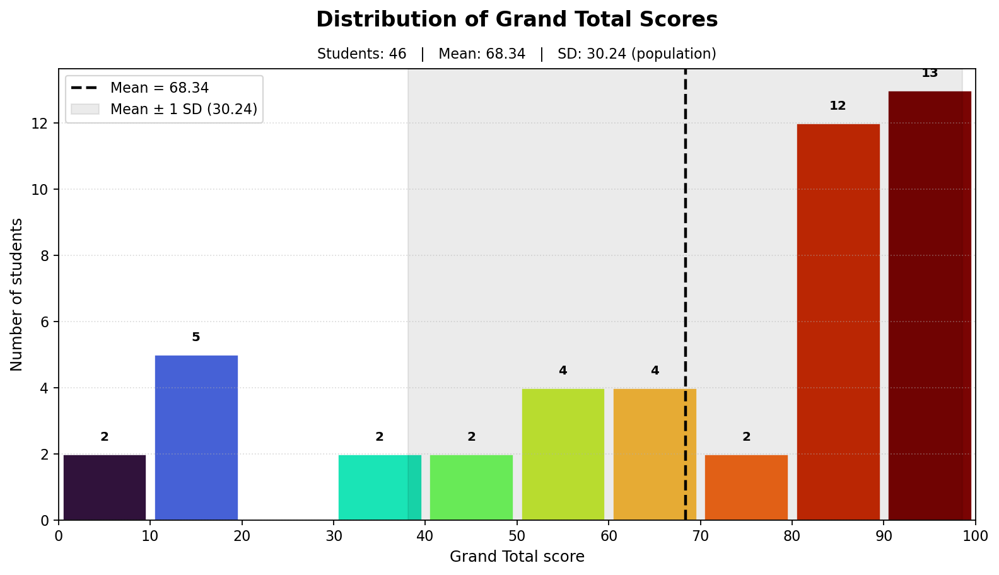

# Class Performance Summary

Exercise: 70% · Attendance: 30% · Exercise maximum: 22 · Attendance sessions: 2

**Grand Total statistics:** Students = 46 · Mean = 68.34 · SD = 30.24 (population)

| No. | Student ID | Name | Exercise | Exercise 70% | Attendance | Attendance 30% | Grand Total | Performance |
|---:|:---:|:---|---:|---:|:---:|---:|---:|:---:|
| 1 | 6610553157 | ---- | 8.00/22.00 | 25.45 | 1/2 | 15.00 | **40.45** | ★☆☆☆☆ |
| 2 | 6610553165 | ---- | 0.00/22.00 | 0.00 | 1/2 | 15.00 | **15.00** | ★☆☆☆☆ |
| 3 | 6610553173 | ---- | 0.00/22.00 | 0.00 | 1/2 | 15.00 | **15.00** | ★☆☆☆☆ |
| 4 | 6610553181 | ---- | 18.00/22.00 | 57.27 | 2/2 | 30.00 | **87.27** | ★★★★☆ |
| 5 | 6610553203 | ---- | 7.00/22.00 | 22.27 | 2/2 | 30.00 | **52.27** | ★☆☆☆☆ |
| 6 | 6610553220 | ---- | 0.00/22.00 | 0.00 | 1/2 | 15.00 | **15.00** | ★☆☆☆☆ |
| 7 | 6610553238 | ---- | 0.00/22.00 | 0.00 | 1/2 | 15.00 | **15.00** | ★☆☆☆☆ |
| 8 | 6610553254 | ---- | 20.00/22.00 | 63.64 | 2/2 | 30.00 | **93.64** | ★★★★★ |
| 9 | 6610553262 | ---- | 10.00/22.00 | 31.82 | 2/2 | 30.00 | **61.82** | ★★☆☆☆ |
| 10 | 6610553271 | ---- | 20.00/22.00 | 63.64 | 2/2 | 30.00 | **93.64** | ★★★★★ |
| 11 | 6610553289 | ---- | 0.00/22.00 | 0.00 | 1/2 | 15.00 | **15.00** | ★☆☆☆☆ |
| 12 | 6610553327 | ---- | 0.00/22.00 | 0.00 | 0/2 | 0.00 | **0.00** | ★☆☆☆☆ |
| 13 | 6610554153 | ---- | 21.00/22.00 | 66.82 | 0/2 | 0.00 | **66.82** | ★★☆☆☆ |
| 14 | 6610554161 | ---- | 12.00/22.00 | 38.18 | 2/2 | 30.00 | **68.18** | ★★☆☆☆ |
| 15 | 6710552942 | ---- | 17.00/22.00 | 54.09 | 2/2 | 30.00 | **84.09** | ★★★★☆ |
| 16 | 6710552951 | ---- | 18.00/22.00 | 57.27 | 2/2 | 30.00 | **87.27** | ★★★★☆ |
| 17 | 6710552969 | ---- | 18.00/22.00 | 57.27 | 2/2 | 30.00 | **87.27** | ★★★★☆ |
| 18 | 6710552977 | ---- | 13.00/22.00 | 41.36 | 2/2 | 30.00 | **71.36** | ★★★☆☆ |
| 19 | 6710552985 | ---- | 22.00/22.00 | 70.00 | 2/2 | 30.00 | **100.00** | ★★★★★ |
| 20 | 6710552993 | ---- | 7.00/22.00 | 22.27 | 1/2 | 15.00 | **37.27** | ★☆☆☆☆ |
| 21 | 6710553001 | ---- | 14.00/22.00 | 44.55 | 1/2 | 15.00 | **59.55** | ★☆☆☆☆ |
| 22 | 6710553027 | ---- | 16.00/22.00 | 50.91 | 2/2 | 30.00 | **80.91** | ★★★★☆ |
| 23 | 6710553035 | ---- | 21.50/22.00 | 68.41 | 2/2 | 30.00 | **98.41** | ★★★★★ |
| 24 | 6710553051 | ---- | 0.00/22.00 | 0.00 | 0/2 | 0.00 | **0.00** | ★☆☆☆☆ |
| 25 | 6710553078 | ---- | 22.00/22.00 | 70.00 | 2/2 | 30.00 | **100.00** | ★★★★★ |
| 26 | 6710553086 | ---- | 5.00/22.00 | 15.91 | 1/2 | 15.00 | **30.91** | ★☆☆☆☆ |
| 27 | 6710553094 | ---- | 12.00/22.00 | 38.18 | 1/2 | 15.00 | **53.18** | ★☆☆☆☆ |
| 28 | 6710553108 | ---- | 18.00/22.00 | 57.27 | 2/2 | 30.00 | **87.27** | ★★★★☆ |
| 29 | 6710553124 | ---- | 19.00/22.00 | 60.45 | 2/2 | 30.00 | **90.45** | ★★★★★ |
| 30 | 6710553141 | ---- | 21.00/22.00 | 66.82 | 2/2 | 30.00 | **96.82** | ★★★★★ |
| 31 | 6710553167 | ---- | 10.00/22.00 | 31.82 | 1/2 | 15.00 | **46.82** | ★☆☆☆☆ |
| 32 | 6710553191 | ---- | 22.00/22.00 | 70.00 | 2/2 | 30.00 | **100.00** | ★★★★★ |
| 33 | 6710553205 | ---- | 20.00/22.00 | 63.64 | 2/2 | 30.00 | **93.64** | ★★★★★ |
| 34 | 6710553213 | ---- | 20.00/22.00 | 63.64 | 2/2 | 30.00 | **93.64** | ★★★★★ |
| 35 | 6710553264 | ---- | 17.00/22.00 | 54.09 | 2/2 | 30.00 | **84.09** | ★★★★☆ |
| 36 | 6710553272 | ---- | 18.00/22.00 | 57.27 | 2/2 | 30.00 | **87.27** | ★★★★☆ |
| 37 | 6710553281 | ---- | 12.00/22.00 | 38.18 | 2/2 | 30.00 | **68.18** | ★★☆☆☆ |
| 38 | 6710553299 | ---- | 18.00/22.00 | 57.27 | 2/2 | 30.00 | **87.27** | ★★★★☆ |
| 39 | 6710553329 | ---- | 8.00/22.00 | 25.45 | 2/2 | 30.00 | **55.45** | ★☆☆☆☆ |
| 40 | 6710553337 | ---- | 17.00/22.00 | 54.09 | 2/2 | 30.00 | **84.09** | ★★★★☆ |
| 41 | 6710553345 | ---- | 17.00/22.00 | 54.09 | 2/2 | 30.00 | **84.09** | ★★★★☆ |
| 42 | 6710553353 | ---- | 21.00/22.00 | 66.82 | 2/2 | 30.00 | **96.82** | ★★★★★ |
| 43 | 6710553361 | ---- | 21.00/22.00 | 66.82 | 2/2 | 30.00 | **96.82** | ★★★★★ |
| 44 | 6710553370 | ---- | 14.00/22.00 | 44.55 | 2/2 | 30.00 | **74.55** | ★★★☆☆ |
| 45 | 6710553388 | ---- | 22.00/22.00 | 70.00 | 2/2 | 30.00 | **100.00** | ★★★★★ |
| 46 | 6710553396 | ---- | 18.00/22.00 | 57.27 | 2/2 | 30.00 | **87.27** | ★★★★☆ |

Performance rating: ★★★★★ ≥ 90, ★★★★☆ ≥ 80, ★★★☆☆ ≥ 70, ★★☆☆☆ ≥ 60, ★☆☆☆☆ &lt; 60.
